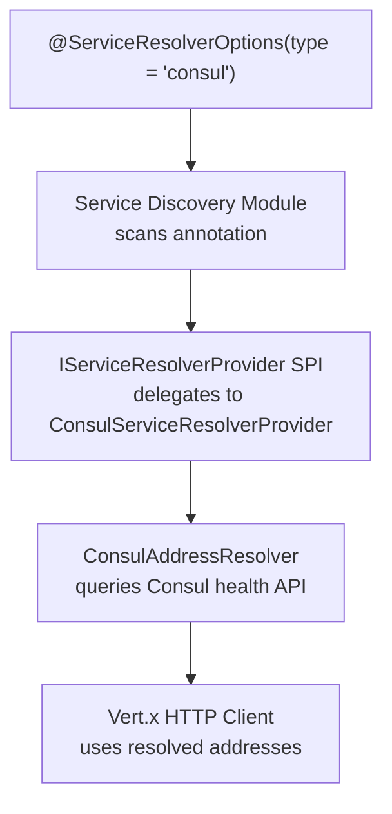
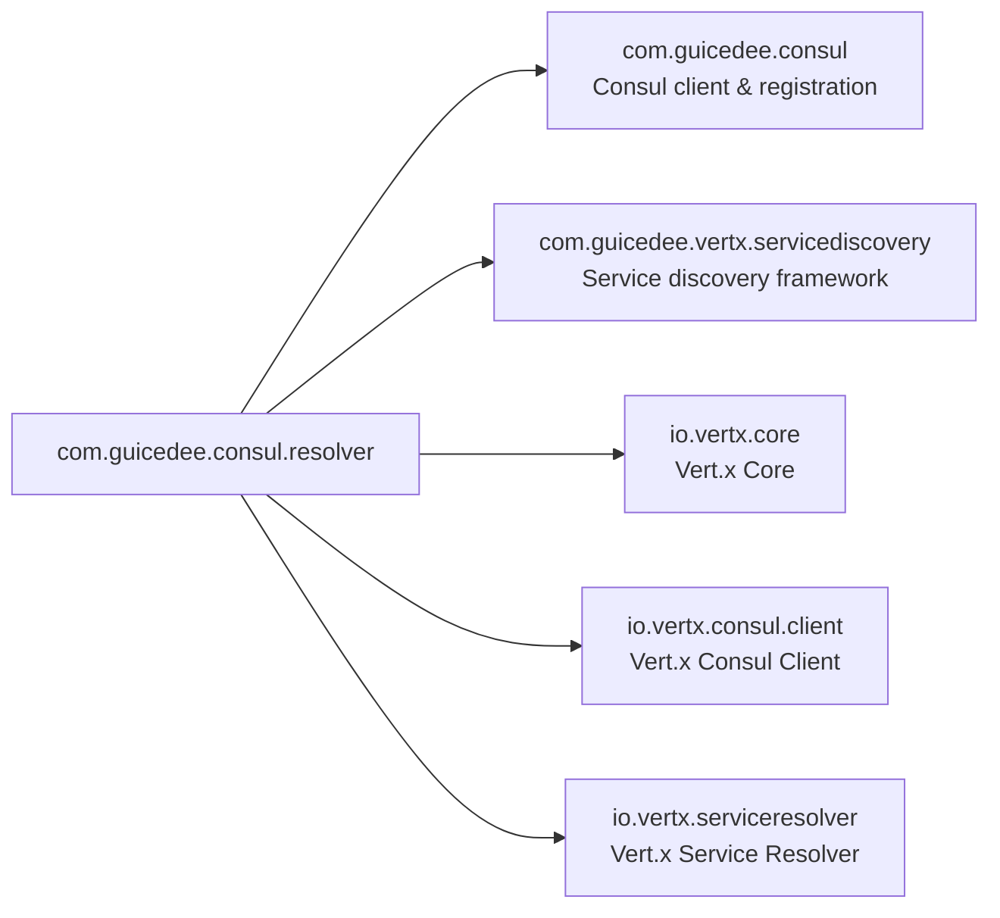

# GuicedEE Consul Service Resolver

[](https://github.com/GuicedEE/GuicedConsulServiceResolver/actions/workflows/build.yml)
[](https://github.com/GuicedEE/GuicedConsulServiceResolver)
[](https://www.apache.org/licenses/LICENSE-2.0)


Bridges **Consul health/catalog lookups** into the GuicedEE service-discovery module via the `IServiceResolverProvider` SPI. Provides a Consul-backed `AddressResolver` for Vert.x HTTP clients with automatic healthy-instance load balancing.

Built on [Vert.x 5](https://vertx.io/) · [Vert.x Consul Client](https://vertx.io/docs/vertx-consul-client/java/) · [GuicedEE Consul](../consul) · [GuicedEE Service Discovery](../service-discovery) · JPMS module `com.guicedee.consul.resolver` · Java 25+

## 📦 Installation

```xml
<dependency>
  <groupId>com.guicedee</groupId>
  <artifactId>consul-service-resolver</artifactId>
</dependency>
```

<details>
<summary>Gradle (Kotlin DSL)</summary>

```kotlin
implementation("com.guicedee:consul-service-resolver:2.1.0-SNAPSHOT")
```
</details>

## ✨ Features

- **Consul-backed service resolution** — queries `healthServiceNodes(serviceName, passingOnly=true)` for healthy instances
- **SPI integration** — implements `IServiceResolverProvider` for seamless plug-in to service-discovery
- **Shared Consul configuration** — reuses `@ConsulOptions` from the core consul module
- **Per-resolver overrides** — configure consul connection per-resolver via `@ServiceResolverOptions` attributes
- **Environment variable overrides** — `SERVICE_RESOLVER_{NAME}_CONSUL_HOST` etc.
- **Load-balanced HTTP clients** — Vert.x HTTP/Web clients use resolved instances automatically

## 🚀 Quick Start

**Step 1** — Declare a Consul-based resolver on your client package:

```java
@ServiceResolverOptions(value = "wallet-api", type = "consul")
package com.myapp.wallet.client;

import com.guicedee.vertx.servicediscovery.ServiceResolverOptions;
```

**Step 2** — Use with Vert.x HTTP Client or `@Endpoint` / `RestClient`:

```java
HttpClient client = vertx.httpClientBuilder()
    .withAddressResolver(resolver)
    .build();

ServiceAddress serviceAddress = ServiceAddress.of("wallet-api");
client.request(new RequestOptions()
    .setMethod(HttpMethod.GET)
    .setURI("/api/wallets")
    .setServer(serviceAddress));
```

The resolver queries Consul for healthy instances of `wallet-api` and load-balances requests across them.

## 📐 Architecture



### How It Works

1. `@ServiceResolverOptions(type = "consul")` is scanned by the service-discovery module
2. The SPI `IServiceResolverProvider` delegates to `ConsulServiceResolverProvider`
3. A `ConsulAddressResolver` is created using Consul connection details from either:
   - The `@ServiceResolverOptions` consul fields (`consulHost`, `consulPort`, etc.)
   - Or the `@ConsulOptions` annotation discovered by the consul core module
4. The resolver queries `healthServiceNodes(serviceName, passingOnly=true)` for healthy instances
5. Vert.x HTTP/Web clients use these instances for load-balanced requests

## ⚙️ Configuration

Consul connection can be configured via:

| Method | Example |
|---|---|
| `@ServiceResolverOptions` attributes | `@ServiceResolverOptions(consulHost = "consul.internal", consulPort = 8500)` |
| Matching `@ConsulOptions` annotation | Preferred for shared config across modules |
| Environment variables | `SERVICE_RESOLVER_WALLET_API_CONSUL_HOST=consul.internal` |

### Environment Variable Overrides

| Pattern | Example |
|---|---|
| `SERVICE_RESOLVER_{NAME}_CONSUL_HOST` | `SERVICE_RESOLVER_WALLET_API_CONSUL_HOST=consul.internal` |
| `SERVICE_RESOLVER_{NAME}_CONSUL_PORT` | `SERVICE_RESOLVER_WALLET_API_CONSUL_PORT=8500` |
| `SERVICE_RESOLVER_{NAME}_CONSUL_TOKEN` | `SERVICE_RESOLVER_WALLET_API_CONSUL_TOKEN=my-token` |

## 🗺️ Module Graph



## 🧩 JPMS

Module name: **`com.guicedee.consul.resolver`**

The module:
- **exports** `com.guicedee.consul.resolver`
- **provides** `IServiceResolverProvider` with `ConsulServiceResolverProvider`

```java
module my.app {
    requires com.guicedee.consul.resolver;
}
```

## 🏗️ Key Classes

| Class | Role |
|---|---|
| `ConsulServiceResolverProvider` | `IServiceResolverProvider` implementation for Consul |
| `ConsulAddressResolver` | Vert.x `AddressResolver` that queries Consul health API |
| `ConsulEndpointResolver` | Resolves endpoints from Consul catalog/health responses |

## 🤝 Contributing

Issues and pull requests are welcome — please add tests for new resolver features.

## 📄 License

[Apache 2.0](https://www.apache.org/licenses/LICENSE-2.0)
